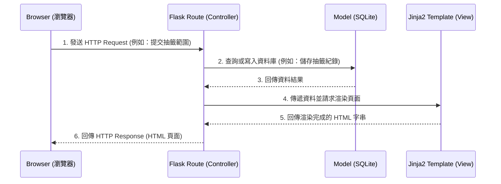

# 系統架構設計 - 隨機抽號系統

本文件根據產品需求文件 (PRD) 規劃「隨機抽號系統」的技術架構與檔案結構，為後續開發提供指引。

## 1. 技術架構說明

本專案採用伺服器端渲染 (Server-Side Rendering, SSR) 架構，不採用前後端分離，所有頁面均由後端動態產生並回傳給瀏覽器。

- **後端框架：Python + Flask**
  - **選用原因**：Flask 是輕量級的 Python Web 框架，適合快速開發中小型專案。它具備極高的彈性，且擁有豐富的生態系可滿足本專案的路由、Session 管理與使用者認證需求。
- **模板引擎：Jinja2**
  - **選用原因**：與 Flask 高度整合，能夠在伺服器端將動態資料（如抽籤結果、使用者清單）直接渲染成 HTML 頁面。
- **資料庫：SQLite**
  - **選用原因**：輕量級關聯式資料庫，不需要獨立伺服器即可運行。資料以單一檔案儲存，對於初期需求（紀錄儲存、使用者管理）來說設定簡單且效能已足夠。
- **Flask MVC 模式說明**：
  - **Model (模型)**：負責定義資料結構與資料庫互動（如：使用者、抽籤紀錄、名單選項）。
  - **View (視圖)**：Jinja2 模板，負責呈現 HTML 與 CSS 給使用者看，顯示最終的資料與互動介面。
  - **Controller (控制器)**：Flask 路由 (`routes`)，負責接收使用者的 Request，從 Model 取出或寫入資料，然後把資料交給 View 去渲染。

## 2. 專案資料夾結構

以下是本專案建議的目錄結構設計：

```text
web_app_development/
├── app/                      ← 應用程式的主要程式碼目錄
│   ├── __init__.py           ← Flask 應用程式工廠 (Application Factory) 的初始化檔
│   ├── models/               ← 資料庫模型 (Model)
│   │   ├── __init__.py
│   │   ├── user.py           ← 使用者資料表定義
│   │   ├── draw_record.py    ← 抽籤紀錄資料表定義
│   │   └── list_item.py      ← 自訂名單與選項資料表定義
│   ├── routes/               ← 路由與業務邏輯 (Controller)
│   │   ├── __init__.py
│   │   ├── auth.py           ← 註冊、登入與登出等身份驗證相關路由
│   │   ├── main.py           ← 首頁與一般介紹頁面路由
│   │   └── draw.py           ← 抽籤、設定範圍、輸入名單等核心功能路由
│   ├── templates/            ← HTML 模板檔案 (View)
│   │   ├── base.html         ← 共用版型（包含導覽列與頁尾）
│   │   ├── index.html        ← 網站首頁
│   │   ├── auth/             ← 身份驗證相關頁面 (login.html, register.html)
│   │   └── draw/             ← 抽籤相關頁面 (setup.html, result.html, history.html)
│   └── static/               ← 靜態資源 (不需編譯的檔案)
│       ├── css/              ← 樣式表 (style.css)
│       ├── js/               ← 負責前端互動（如抽籤動畫）的腳本 (main.js)
│       └── images/           ← 網站圖片資源
├── instance/                 ← 放置不應該加入版本控制的執行個體檔案
│   └── database.db           ← SQLite 資料庫檔案
├── docs/                     ← 專案文件目錄
│   ├── PRD.md                ← 產品需求文件
│   └── ARCHITECTURE.md       ← 系統架構設計文件 (本文件)
├── requirements.txt          ← Python 套件依賴清單
└── run.py                    ← 啟動 Flask 伺服器的入口檔案
```

## 3. 元件關係圖

以下展示了系統中各個元件的資料流向與互動關係：



## 4. 關鍵設計決策

1. **採用 Application Factory (應用程式工廠) 模式**
   - **原因**：在 `app/__init__.py` 建立 Flask 實例的工廠函式，能讓測試更容易進行，並避免未來專案變大時產生循環依賴的問題。
2. **使用 Blueprint 分割路由**
   - **原因**：將不同功能的路由分門別類拆分到 `auth.py`、`main.py` 與 `draw.py`，避免所有路由都集中在同一個檔案內，不僅程式碼更容易維護，多人協作時也能減少衝突。
3. **密碼安全性設計**
   - **原因**：使用者認證系統的安全性至關重要。決定在 `models/user.py` 存取密碼時，強制使用密碼雜湊加密 (Hash)，如 werkzeug.security，絕對不以明碼儲存密碼。
4. **將所有前端動態互動保持輕量**
   - **原因**：專案不採前後端分離，因此畫面上的動態效果（例如「抽籤時的動畫轉盤或跳動數字」）將依靠原生的 JavaScript 實現，並與 Jinja2 傳遞的資料緊密結合，減少引入大型前端框架的複雜度。
