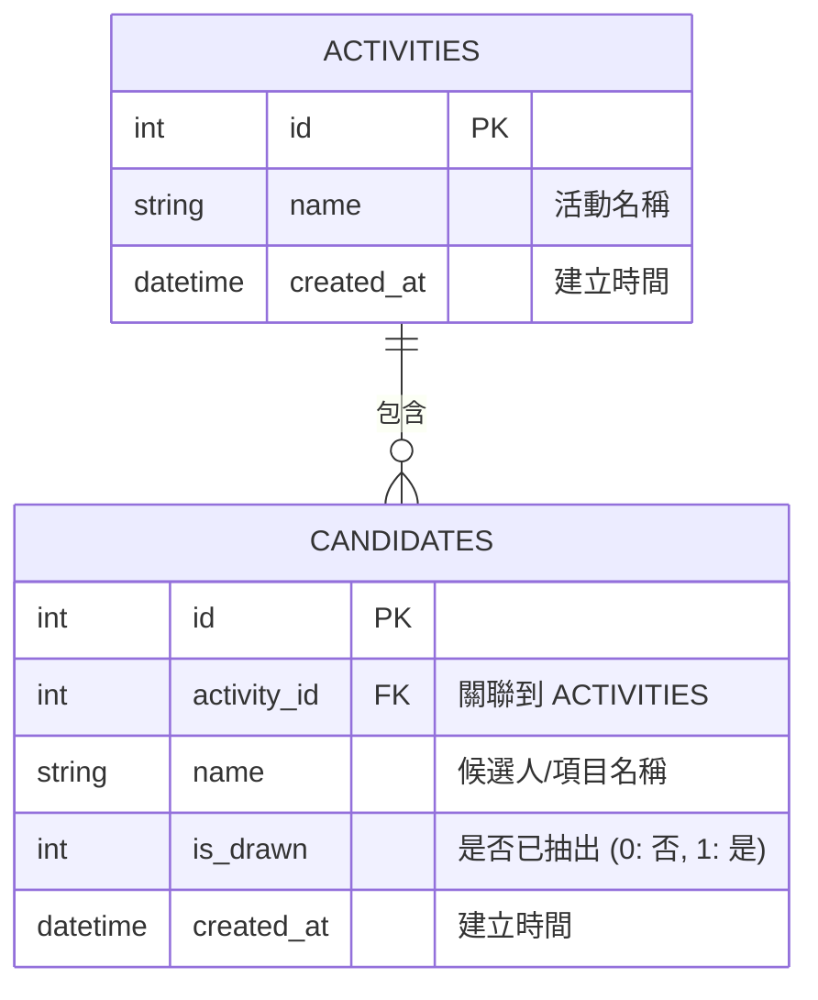

# DB Design - 線上抽籤系統

## 1. ER 圖（實體關係圖）

## 2. 資料表詳細說明

### 2.1. `activities` (抽籤活動表)
記錄使用者每次建立的獨立抽籤活動。

| 欄位名稱 | 型別 | 說明 |
| --- | --- | --- |
| `id` | INTEGER PK | Primary Key, 自動遞增 |
| `name` | TEXT | 活動名稱（必須，如：年末尾牙抽獎） |
| `created_at` | DATETIME | 建立時間，預設為資料庫當下時間 |

### 2.2. `candidates` (候選名單表)
記錄各個活動底下手動輸入的人名或候選項目，並用來追蹤是否已經被抽出，實現「不重複抽籤」功能。

| 欄位名稱 | 型別 | 說明 |
| --- | --- | --- |
| `id` | INTEGER PK | Primary Key, 自動遞增 |
| `activity_id` | INTEGER FK | Foreign Key，關聯至 `activities.id` |
| `name` | TEXT | 項目名稱 / 候選人名稱 |
| `is_drawn` | INTEGER | 是否已被抽出 (0: 否, 1: 是)，預設為 0 |
| `created_at` | DATETIME | 建立時間，預設為資料庫當下時間 |

## 3. SQL 建表語法
完整的 SQLite 語法儲存於 `database/schema.sql` 檔案中。

## 4. Python Model
使用 Python 內建的 `sqlite3` 套件實作，將檔案儲存於 `app/models/` 目錄中：
- `app/models/db.py`: 定義連線邏輯
- `app/models/activity.py`: 定義 Activity 的 CRUD 操作
- `app/models/candidate.py`: 定義 Candidate 的 CRUD 操作
