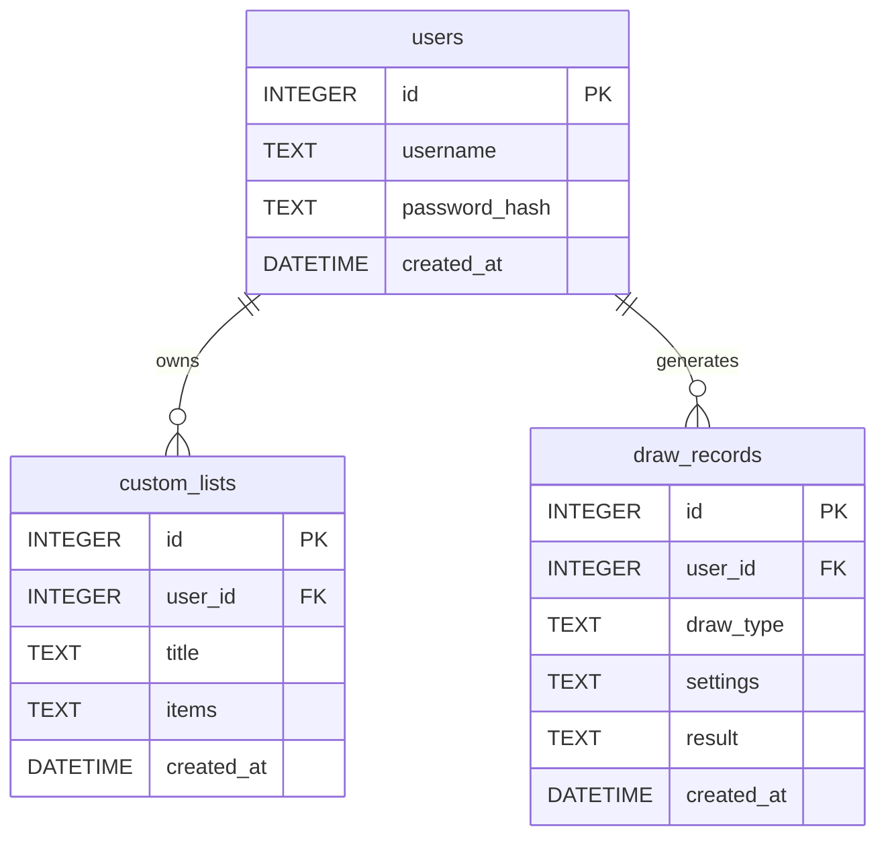

# DB Design - 隨機抽號系統資料庫設計

本文件說明「隨機抽號系統」的資料庫結構。系統採用 SQLite 關聯式資料庫儲存使用者、自訂抽籤名單及歷史抽籤紀錄。

## 1. ER 圖（實體關係圖）

## 2. 資料表詳細說明

### 2.1 使用者資料表 (`users`)
儲存登入使用者的帳號密碼資訊。
- `id` (INTEGER, PK): 使用者唯一識別碼，自動遞增。
- `username` (TEXT, UNIQUE): 登入帳號，必填且唯一。
- `password_hash` (TEXT): 經過加密的密碼字串，必填。
- `created_at` (DATETIME): 帳號建立時間，預設為當下時間。

### 2.2 自訂名單資料表 (`custom_lists`)
儲存登入使用者自訂好的抽籤清單（例如：學生名單、員工名單）。
- `id` (INTEGER, PK): 名單唯一識別碼，自動遞增。
- `user_id` (INTEGER, FK): 所屬使用者 ID，必填。
- `title` (TEXT): 名單標題，必填。
- `items` (TEXT): 儲存名單選項內容（以 JSON 陣列字串格式儲存，如 `["Alice", "Bob"]`），必填。
- `created_at` (DATETIME): 建立時間，預設為當下時間。

### 2.3 抽籤紀錄資料表 (`draw_records`)
儲存每次抽籤的設定與最終結果，可供分享與事後查閱。
- `id` (INTEGER, PK): 紀錄唯一識別碼，自動遞增。
- `user_id` (INTEGER, FK): 抽籤的使用者 ID。若未登入抽籤則可為 NULL。
- `draw_type` (TEXT): 抽籤類型（如 `'number'` 或 `'custom'`），必填。
- `settings` (TEXT): 抽籤時的條件設定（以 JSON 格式儲存），必填。
- `result` (TEXT): 抽出來的結果內容（以 JSON 陣列格式儲存），必填。
- `created_at` (DATETIME): 抽籤執行時間，預設為當下時間。

## 3. SQL 建表語法

建表語法儲存在 `database/schema.sql` 檔案中，包含所有資料表結構。

## 4. Python Model 程式碼

我們採用 `sqlite3` 作為 Python 實作，程式碼位於 `app/models/` 目錄中，並實作了靜態的 CRUD 方法以簡化與 Controller 之間的互動。包含的檔案：
- `db.py`: 管理資料庫連線與初始化
- `user.py`: 使用者模型的建立與查詢
- `custom_list.py`: 名單的 CRUD
- `draw_record.py`: 抽籤紀錄的寫入與查詢
