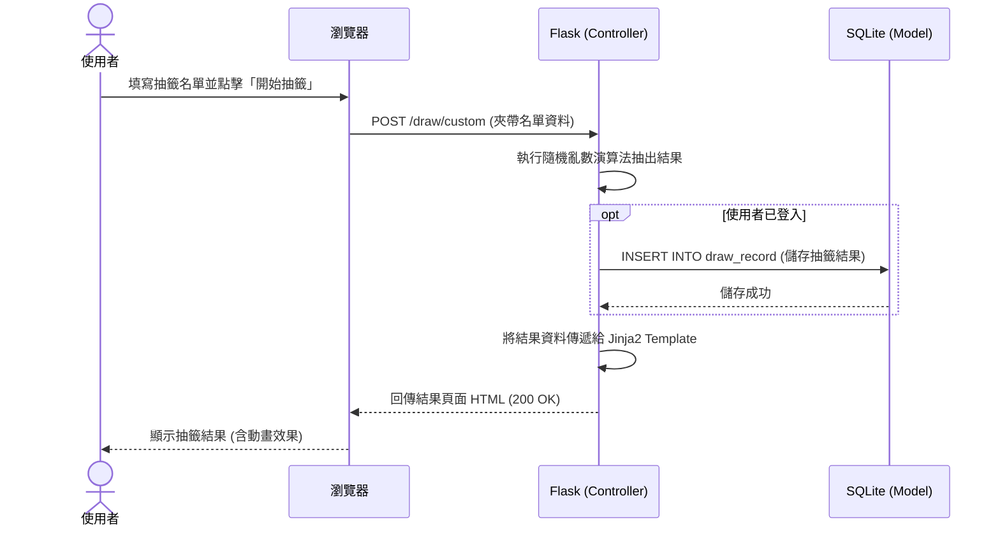

# 流程圖設計 - 隨機抽號系統

本文件根據產品需求文件 (PRD) 與系統架構設計 (ARCHITECTURE)，定義了系統的使用者操作流程、核心系統資料流以及各功能的路由對照表。

## 1. 使用者流程圖 (User Flow)

這張圖展示了使用者進入網站後的主要操作路徑，包含兩種抽籤方式（數字範圍、自訂名單）、登入流程，以及結果分享與歷史紀錄查詢。

```mermaid
flowchart LR
    A([進入網站首頁]) --> B{是否要登入？}
    B -->|是| C[登入/註冊頁面]
    C -->|成功| D[返回首頁 (已登入狀態)]
    B -->|否| D[留在首頁]
    
    D --> E{選擇抽籤方式}
    E -->|數字範圍| F[設定數字範圍與抽出數量]
    E -->|自訂名單| G[輸入或載入選項清單]
    
    F --> H[點擊「開始抽籤」]
    G --> H
    
    H --> I[顯示抽籤結果頁面]
    
    I --> J[分享結果 (複製連結或匯出)]
    I --> K[再次抽籤]
    
    D -->|點擊導覽列| L{身分驗證}
    L -->|已登入| M[查看歷史紀錄頁面]
    L -->|未登入| C
```

## 2. 系統序列圖 (Sequence Diagram)

這張圖展示了使用者在「自訂名單抽籤」並將結果「儲存至歷史紀錄」時，系統背後的運作流程與資料傳遞情形。



## 3. 功能清單對照表

本表列出了 PRD 定義的主要功能所對應的 URL 路徑與 HTTP 方法，供前後端開發與串接參考。

| 功能名稱 | URL 路徑 | HTTP 方法 | 說明 |
| :--- | :--- | :--- | :--- |
| **網站首頁** | `/` | GET | 顯示網站介紹與抽籤選項入口 |
| **註冊帳號** | `/auth/register` | GET / POST | GET: 顯示註冊表單<br>POST: 提交註冊資料 |
| **登入系統** | `/auth/login` | GET / POST | GET: 顯示登入表單<br>POST: 驗證帳號密碼 |
| **登出系統** | `/auth/logout` | GET | 清除 Session 並登出 |
| **數字抽籤設定** | `/draw/number` | GET | 顯示數字範圍設定表單 |
| **數字抽籤執行** | `/draw/number` | POST | 接收設定，執行抽籤並轉交結果 |
| **名單抽籤設定** | `/draw/custom` | GET | 顯示自訂名單/選項輸入表單 |
| **名單抽籤執行** | `/draw/custom` | POST | 接收名單，執行抽籤並轉交結果 |
| **抽籤結果顯示** | `/draw/result/<id>` | GET | 依據抽籤 ID 顯示特定的結果頁面，可用於分享 |
| **歷史紀錄查詢** | `/draw/history` | GET | 列出登入使用者過去儲存的抽籤紀錄 |
